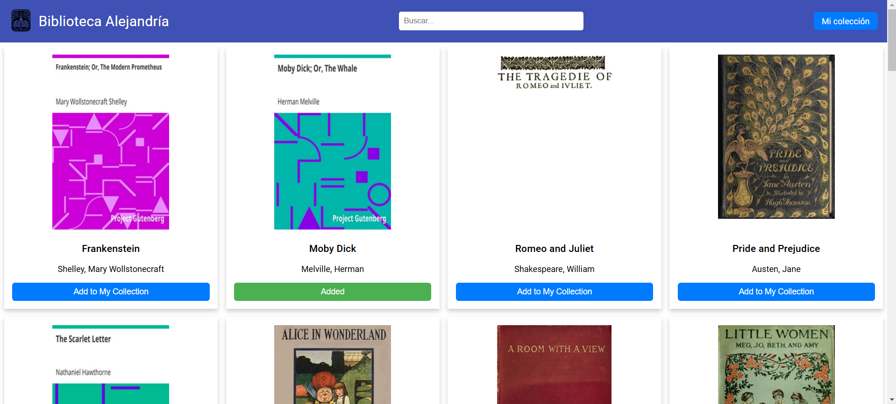
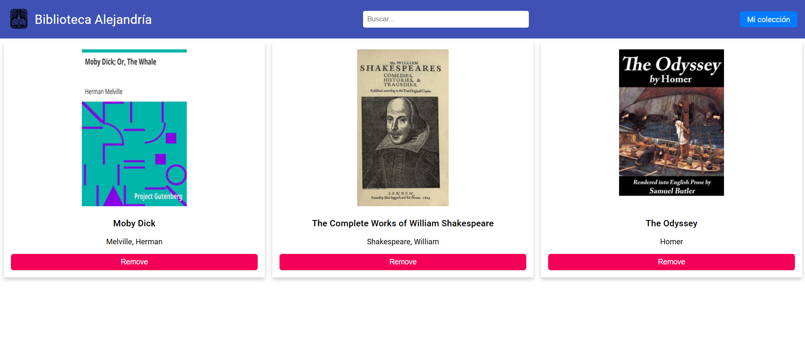
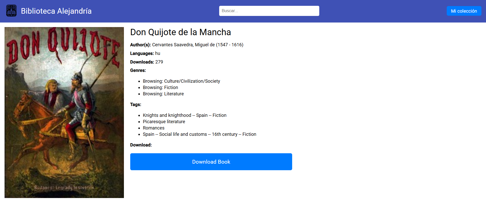

# Biblioteca Virtual

Proyecto individual para la asignatura **Desarrollo Rápido de Aplicaciones**. Este proyecto es una aplicación web desarrollada con Angular en el frontend y Spring Boot en el backend. Permite a los usuarios buscar libros a través de la API de Gutendex, añadir libros favoritos a una colección y gestionar la lista de favoritos de forma persistente.

## Características

- **Búsqueda de libros**: Explora libros utilizando la API de Gutendex.
- **Gestión de favoritos**: Añade o elimina libros de tu colección personal.
- **Persistencia de datos**: La lista de favoritos se almacena en un backend desarrollado con Spring Boot.
- **Interfaz intuitiva**: Un diseño fácil de usar para gestionar libros y favoritos.

## Tecnologías utilizadas

### Frontend
- **Angular**: Framework para la creación de la interfaz de usuario.
- **TypeScript**: Lenguaje principal del desarrollo frontend.
- **Bootstrap**: Estilos y diseño responsivo.
- **Angular HttpClient**: Comunicación con el backend.

### Backend
- **Spring Boot**: Framework para el desarrollo del backend.
- **H2 Database**: Base de datos en memoria para desarrollo y pruebas.
- **Spring Data JPA**: Gestión de la persistencia de datos.
- **CORS Configuration**: Configuración para permitir la comunicación entre el frontend y el backend.

## Uso

### Buscar libros
Accede a la vista principal y explora los libros disponibles.

### Añadir a favoritos
Haz clic en el botón **"Add to My Collection"** para añadir un libro a tu lista de favoritos.

### Ver y gestionar favoritos
Navega a la sección **"My Collection"** para ver los libros favoritos y eliminarlos si es necesario.

## Capturas de pantalla

### Vista principal:

### Vista colección:

### Vista libro:

